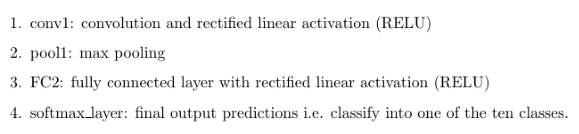
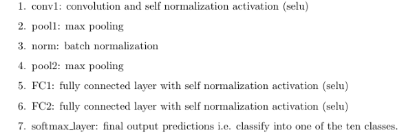
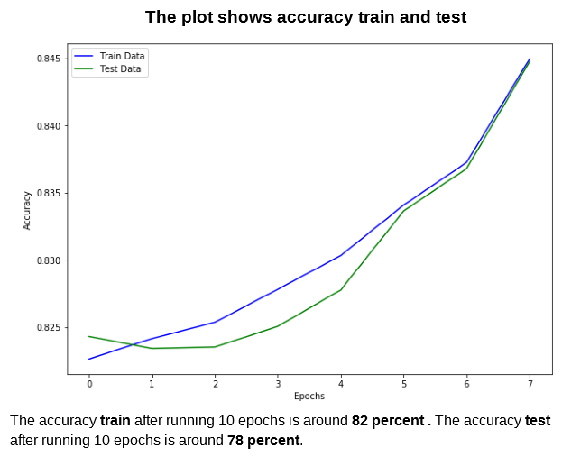
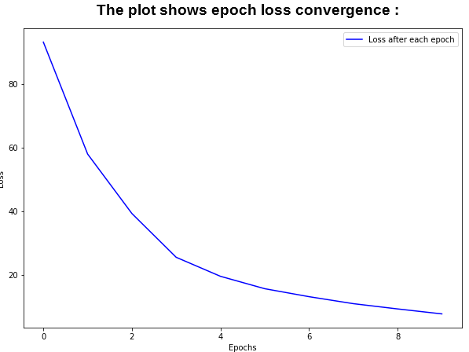
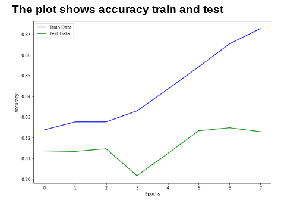
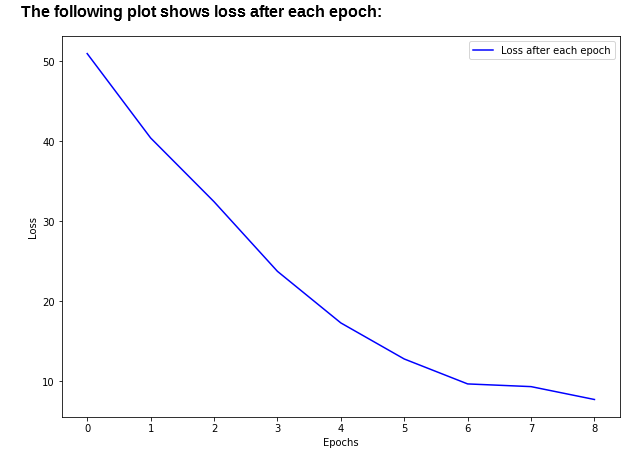

# Basic-CNN-on-CIFAR-10
Building a CNN in TensorFlow to classify images in CIFAR-10 dataset and comparing models with different configurations to see the effect on accuracy.

# Goal 
* To learn handling of image data and pre processing
* See what *Convolutional layers* actually outputs
* See the effect of *maxpool* and *batch normalization* layer
* Train CNN's with different configurations and plot train/test accuracies.

# Layers configurations used 
### Config 1:


```python
def CNN(x_input):
    weights = {'W_conv1':tf.Variable(tf.random_normal([5,5,3,1])),'W_fc':tf.Variable(tf.random_normal([1*16*16,3072]))
               ,'W_out':tf.Variable(tf.random_normal([3072,10]))}
    biases =  {'W_out':tf.Variable(tf.random_normal([10])),'W_fc':tf.Variable(tf.random_normal([3072]))}
    x_inp=tf.reshape(x_input,shape=[-1,32,32,3])
    
    "1.convolution layer 1 with relu activation"
    conv1 = conv2d(x_inp,weights['W_conv1'])
    conv1_out = tf.nn.relu(conv1)
    "2. Maxpool layer"
    maxpool1 = maxpool(conv1_out)
    "3. Fully connected layer 1: Relu activation "
    fc= tf.reshape(maxpool1,[-1,16*16*1])
    fc = tf.nn.relu(tf.matmul(fc,weights['W_fc'])+biases['W_fc'])
    "4. Returns output of size: [batch_size, 10 ] as there are 10 number of classes"
    "   softmax of this layer is done in the training pipeline"
    final_output = tf.matmul(fc,weights['W_out']) + biases['W_out']
    return final_output
```


### Config 2:


```python
def CNN(x_input):
    weights = {'W_conv1':tf.Variable(tf.random_normal([5,5,3,1])),'W_fc':tf.Variable(tf.random_normal([1*8*8,3072])),
               'W_fc2':tf.Variable(tf.random_normal([3072,10])),'W_out':tf.Variable(tf.random_normal([3072,10]))}
    biases =  {'W_out':tf.Variable(tf.random_normal([10])),'W_fc2':tf.Variable(tf.random_normal([10])),'W_fc':tf.Variable(tf.random_normal([3072]))}
    x_inp=tf.reshape(x_input,shape=[-1,32,32,3])
    "1.convolution layer 1 with selu activation"
    conv1 = conv2d(x_inp,weights['W_conv1'])
    conv1_out = tf.nn.selu(conv1)
    "2. Maxpool layer"
    maxpool1 = maxpool(conv1_out)
    "3. Norm: Batch normalization"
    normalized_out = batch_normalization(maxpool1)
    "4. Maxpool2"
    maxpool2 = maxpool(normalized_out)
    "5. Fc1 -fully connected layer 1-  SELU activation"
    fc1= tf.reshape(maxpool2,[-1,8*8*1])
    fc1 = tf.nn.selu(tf.matmul(fc1,weights['W_fc'])+biases['W_fc'])
    "6. Fc2 - fully connected layer 2- Selu activation"
    fc2 = tf.reshape(fc1,[-1,3072])
    fc2 = tf.nn.selu(tf.matmul(fc2,weights['W_fc2'])+biases['W_fc2'])
    "7. Softmax layer added in train function"
    return fc2
```
View the jupyter notebooks for the complete code.

### Shapes: 
To build a CNN with tensorflow we must understand the shapes of array at each layer as they must be accurately specified. Also this helps understand the effects of *padding* and *strides* in convolution layer. Following are the shapes of the image as it passes through the config1 layers : 
* Input size = 32 * 32 * 3   (size of image in CIFAR-10)
* Flatten = Converts the shape 32 * 32 * 3 to  [ *Number of images*, 3072 ]
* Conv1 = No change in size as stride = [1,1,1,1]. Thus size remians = [ *Number of images*, 3072 ]
* Maxpool = Maxpool layer with kernel size=[1,2,2,1] reduces the dimension of 32*32 to 16*16.
* Fully connected layer :  Output size = 10 
* Softmax : This is the final output of the CNN. Softmax function gives an array of size 10 which represents the class probablities.

# Results
## Config1 :
The training pipepline with gradient descent optimizer is used with a learning rate of 0.01. The epoch loss and accuracy on test and train data is recorded after each epoch. 





## Config2 :
The training pipepline with gradient descent optimizer is used with a learning rate of 0.01. The epoch loss and accuracy on test and train data is recorded after each epoch. 




